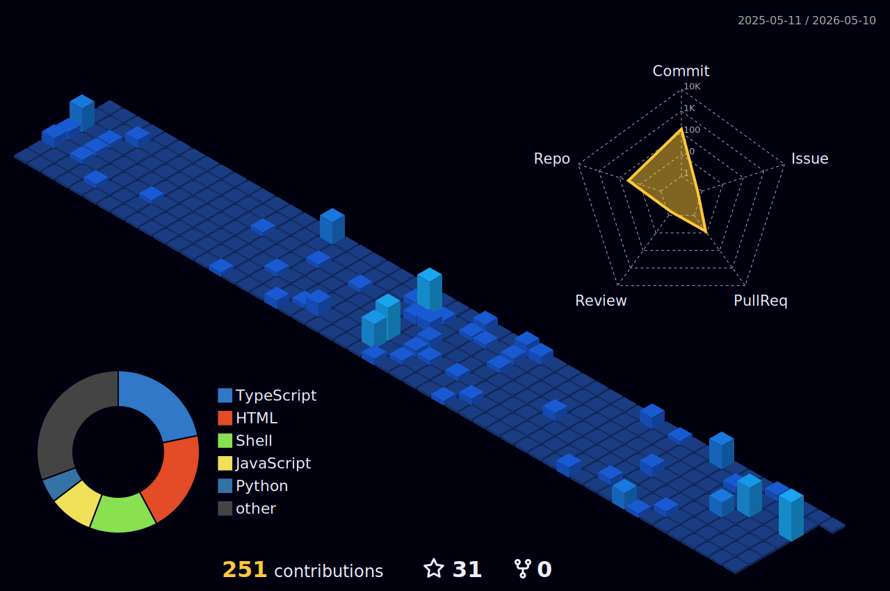
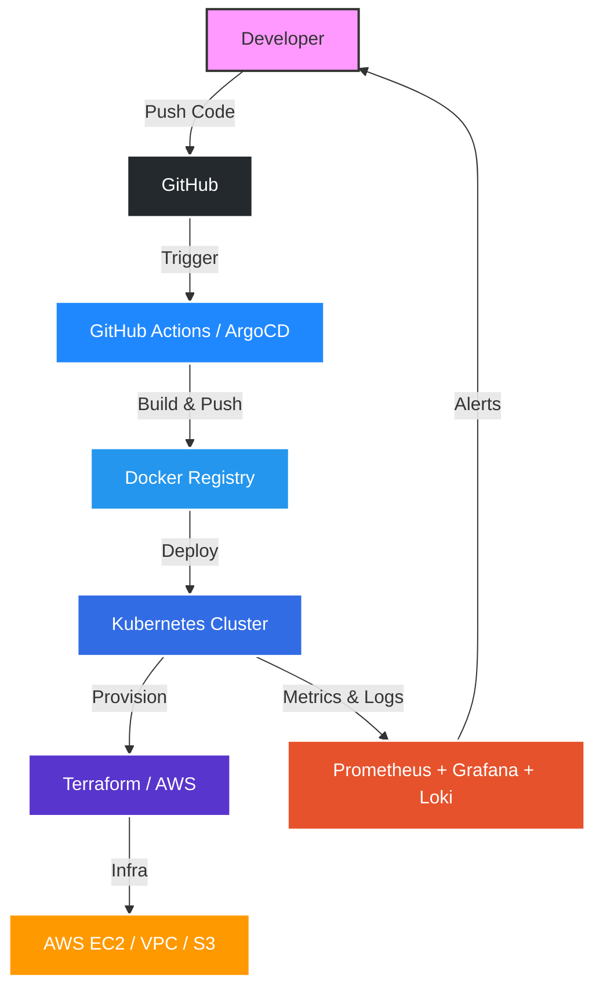

<p align="center">
  
</p>

<h1 align="center">⚡ Hi, I'm Anant Tyagi</h1>
<h3 align="center">🚀 DevOps & Infrastructure Engineer | Cloud-Native Builder | Reliability Enthusiast</h3>

<p align="center">

</p>

---

# 🧠 Terminal Profile

```shell
anant@devops-engineer
──────────────────────────────────────
OS          : Linux (Ubuntu)
Cloud       : AWS (EC2, VPC, S3)
Containers  : Docker, Kubernetes
IaC         : Terraform
CI/CD       : GitHub Actions, Jenkins, ArgoCD
Monitoring  : Prometheus, Grafana, Loki
Languages   : Python, Go (Basic), C
Status      : Building scalable, reliable systems
Location    : Ghaziabad, India
```

<p align="center">
  
  
  
  
</p>

```text
System Status
──────────────────────────────────────
Terraform Infrastructure   ✅ Online
CI/CD Pipeline             ✅ Running
Docker Registry            ✅ Active
Kubernetes Cluster         ⚡ Scaling
Observability Stack        ✅ Monitoring
```

---

# 🎓 Certifications

<p align="center">
  
  
</p>

---

# ⚙️ Tech Stack

### ☁️ Cloud & Infrastructure


### 🐳 Containers & Orchestration


### 🔁 CI/CD & GitOps


### 📈 Monitoring & Observability


### 💻 Languages & Development


### 🗄️ Databases


---

# 🎯 Current Focus

```text
→ Reliability Engineering & Distributed Systems
→ GitOps with ArgoCD
→ AI-integrated DevOps tooling (Kubesimplify)
→ Scalable Cloud Infrastructure on AWS
```

---

# 📊 Dynamic DevOps Dashboard

<p align="center">
  
</p>

# ⏱️ Coding Tracker

<!--START_SECTION:waka-->

```txt
No activity tracked
```

<!--END_SECTION:waka-->

---

# 🐍 Contribution Pipeline

<p align="center">
  <picture>
    <source media="(prefers-color-scheme: dark)" srcset="https://raw.githubusercontent.com/Ananttyagi07/Ananttyagi07/output/github-contribution-grid-snake-dark.svg">
    <source media="(prefers-color-scheme: light)" srcset="https://raw.githubusercontent.com/Ananttyagi07/Ananttyagi07/output/github-contribution-grid-snake.svg">
    
  </picture>
</p>

---

# 🏙️ GitHub Skyline (3D Contribution City)

<p align="center">
  
</p>

---

# 📈 GitHub Stats

<p align="center">


</p>

<p align="center">

</p>

---

# 🛰 DevOps Architecture



---

# 🌍 Connect With Me

<p align="center">
  <a href="mailto:tyagiaadi368@gmail.com">
    
  </a>
  <a href="https://linkedin.com/in/ananttyagi07">
    
  </a>
  <a href="https://github.com/Ananttyagi07">
    
  </a>
</p>

---

<div align="center">
  
</div>


