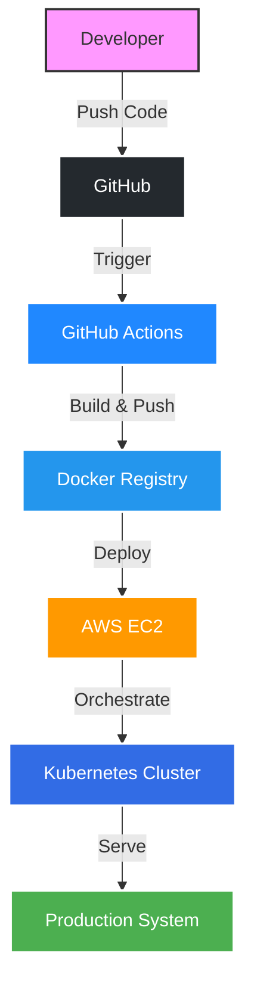

<h1 align="center">⚡ Hi, I'm Anant Tyagi</h1>
<h3 align="center">🚀 DevOps Engineer | Cloud Infrastructure Builder | Linux Power User</h3>

<p align="center">

</p>

---

# 🧠 Terminal Profile

```shell
anant@devops-engineer
─────────────────────
OS        : Linux
Cloud     : AWS
Containers: Docker, Kubernetes
IaC       : Terraform
CI/CD     : GitHub Actions
Status    : Building scalable infrastructure
```

<p align="center">
  
  
  
  
</p>

```text
System Status
──────────────
Terraform Infrastructure   ✅ Online
CI/CD Pipeline             ✅ Running
Docker Registry            ✅ Active
Kubernetes Cluster         ⚡ Scaling
```

---

# ⚙️ DevOps Stack

### ☁️ Cloud & Infrastructure
 

### 🐳 Containers & Orchestration
 

### 🔁 CI/CD & Systems
  

### 💻 Languages
 

---

# 📊 Dynamic DevOps Dashboard

<p align="center">
  
</p>

# ⏱️ Coding Tracker

<!--START_SECTION:waka-->

```txt
No activity tracked
```

<!--END_SECTION:waka-->

---

# 🐍 Contribution Pipeline

<p align="center">
  <picture>
    <source media="(prefers-color-scheme: dark)" srcset="https://raw.githubusercontent.com/Ananttyagi07/Ananttyagi07/output/github-contribution-grid-snake-dark.svg">
    <source media="(prefers-color-scheme: light)" srcset="https://raw.githubusercontent.com/Ananttyagi07/Ananttyagi07/output/github-contribution-grid-snake.svg">
    
  </picture>
</p>

---

# 🏙️ GitHub Skyline (Contribution City)

<p align="center">
  <a href="https://skyline.github.com/Ananttyagi07/2025">
    
  </a>
</p>

---

# 🛰 DevOps Architecture



---

# 🌍 Connect With Me

<p align="center">
  <a href="mailto:yourmail@gmail.com">
    
  </a>
  <a href="https://linkedin.com">
    
  </a>
</p>

---

<div align="center">
  
</div>


