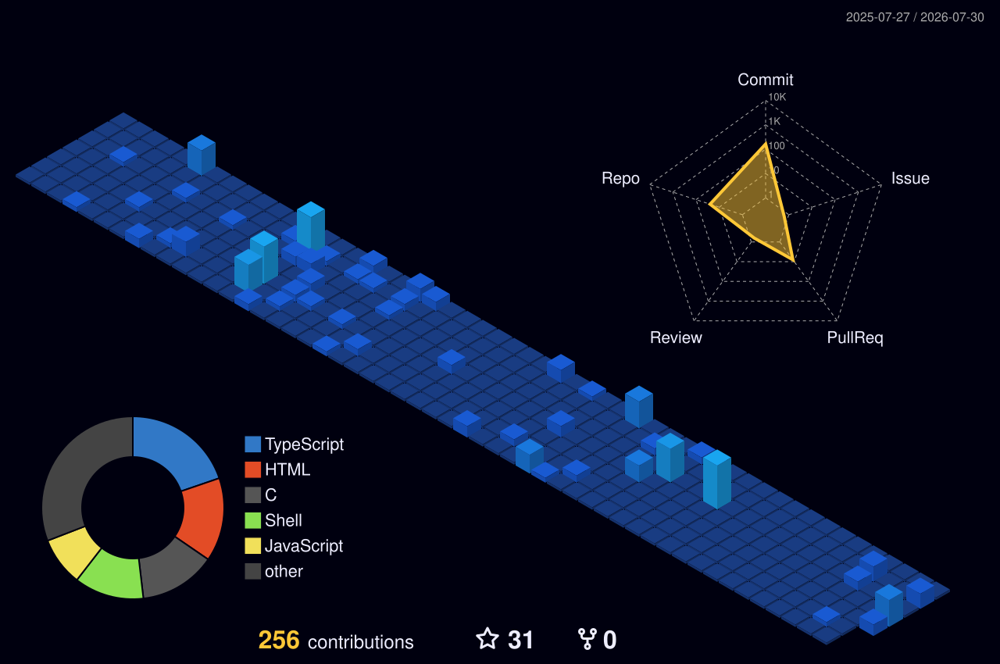

<h1 align="center">⚡ Hi, I'm Anant Tyagi</h1>
<h3 align="center">🚀 DevOps & Infrastructure Engineer | Cloud-Native Builder | Reliability Enthusiast</h3>

---

# 🎓 Certifications

<p align="center">
  
  
</p>

---

# 🧬 Compiled Bytecode, Rendered as Art

Not a template, not a badge service — this is real. A script disassembles the actual compiled `bpf/flow_cgroup.o` from Chidrixx (real basic blocks, real jump instructions, real per-CPU BPF map access) and renders its control-flow graph as generative art: node position from a golden-angle spiral seeded by real program order, size from real instruction count, color from a hash of real instruction content. Blue spiral = the real egress program, amber = the real ingress program.

<p align="center">
  
</p>

[→ how it's generated](https://github.com/Ananttyagi07/chidrixx/blob/master/tools/bpf-art/gen_bpf_art.py)

---

# 🔭 Flagship Project — Chidrixx

An eBPF-based Kubernetes network-cost-attribution agent: attributes live traffic to workloads across 8 network-path classes, verified byte-accurate against real `iperf3` transfers (0.156% delta). Multi-tenant Go control plane built from scratch, React + TypeScript dashboard, 189 backend tests + 27 Playwright E2E tests in a 7-job CI pipeline.

Published under Apache-2.0 — Helm charts and container images public on [GHCR](https://github.com/Ananttyagi07/chidrixx/pkgs/container/charts%2Fchidrixx-controlplane), installable with one command, no auth required.

**[→ github.com/Ananttyagi07/chidrixx](https://github.com/Ananttyagi07/chidrixx)**

---

# 🌱 Open Source

Currently contributing to [**cilium/ebpf**](https://github.com/cilium/ebpf) — the Go library Chidrixx is built on. [PR #2097](https://github.com/cilium/ebpf/pull/2097): converting `Program.Benchmark` to a `testing.B`-idiomatic API.

---

# ⚙️ Tech Stack

### ☁️ Cloud & Infrastructure


### 🐳 Containers & Orchestration


### 🔁 CI/CD & GitOps


### 📈 Monitoring & Observability


### 💻 Languages & Development


### 🗄️ Databases


---

# 🎯 Current Focus

```text
→ eBPF-based Kubernetes observability (Chidrixx)
→ Reliability Engineering & Distributed Systems
→ Contributing to cilium/ebpf
→ Scalable Cloud Infrastructure on AWS
```

---

# 📊 Dynamic DevOps Dashboard

<p align="center">
  
</p>

# ⏱️ Coding Tracker

<!--START_SECTION:waka-->

```txt
Markdown   1 hr 11 mins          ████████████████░░░░░░░░░   64.08 %
Other      31 mins               ███████░░░░░░░░░░░░░░░░░░   28.30 %
HTML       8 mins                ██░░░░░░░░░░░░░░░░░░░░░░░   07.62 %
```

<!--END_SECTION:waka-->

---

# 🐍 Contribution Pipeline

<p align="center">
  <picture>
    <source media="(prefers-color-scheme: dark)" srcset="https://raw.githubusercontent.com/Ananttyagi07/Ananttyagi07/output/github-contribution-grid-snake-dark.svg">
    <source media="(prefers-color-scheme: light)" srcset="https://raw.githubusercontent.com/Ananttyagi07/Ananttyagi07/output/github-contribution-grid-snake.svg">
    
  </picture>
</p>

---

# 🏙️ GitHub Skyline (3D Contribution City)

<p align="center">
  
</p>

---

# 📈 GitHub Stats

<p align="center">


</p>

<p align="center">

</p>

---

# 🌍 Connect With Me

<p align="center">
  <a href="mailto:tyagianant65@gmail.com">
    
  </a>
  <a href="https://linkedin.com/in/anant-tyagi7">
    
  </a>
  <a href="https://github.com/Ananttyagi07">
    
  </a>
</p>

---

<div align="center">
  
</div>
